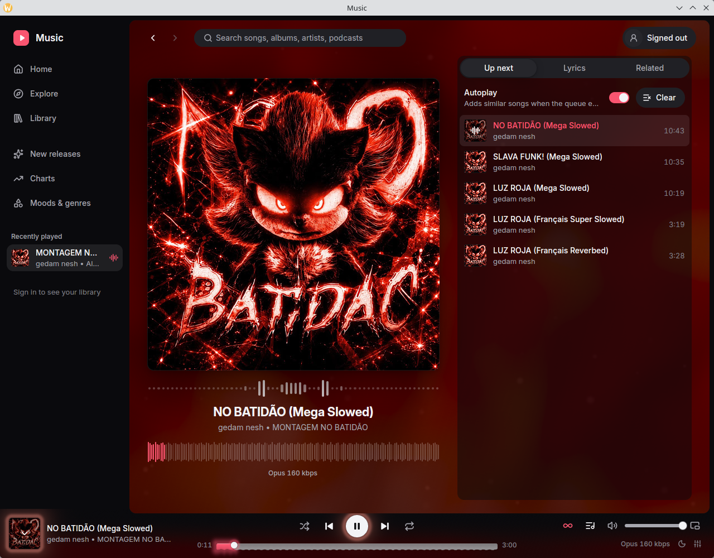
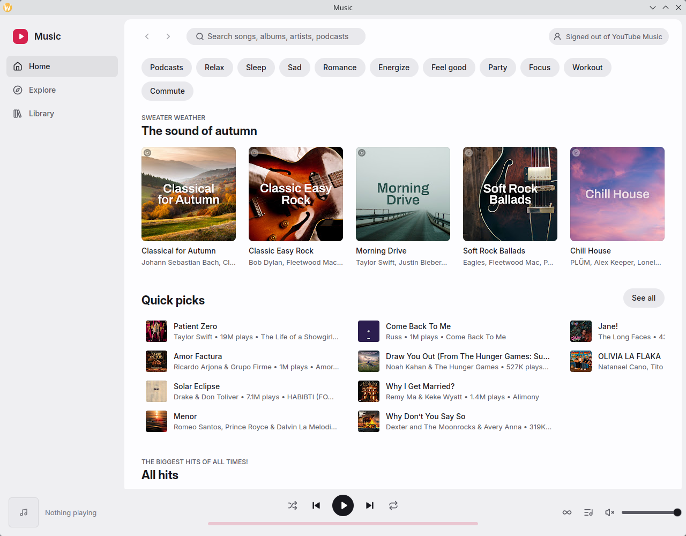
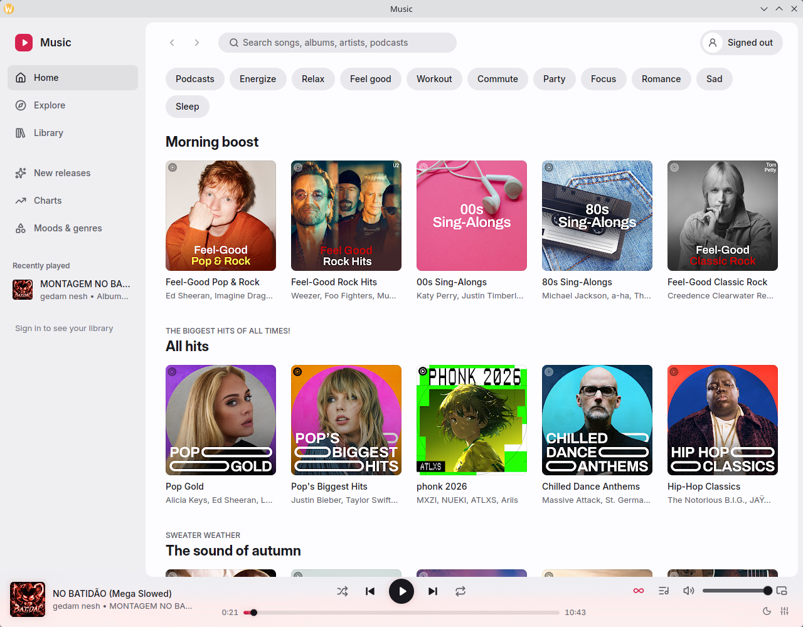
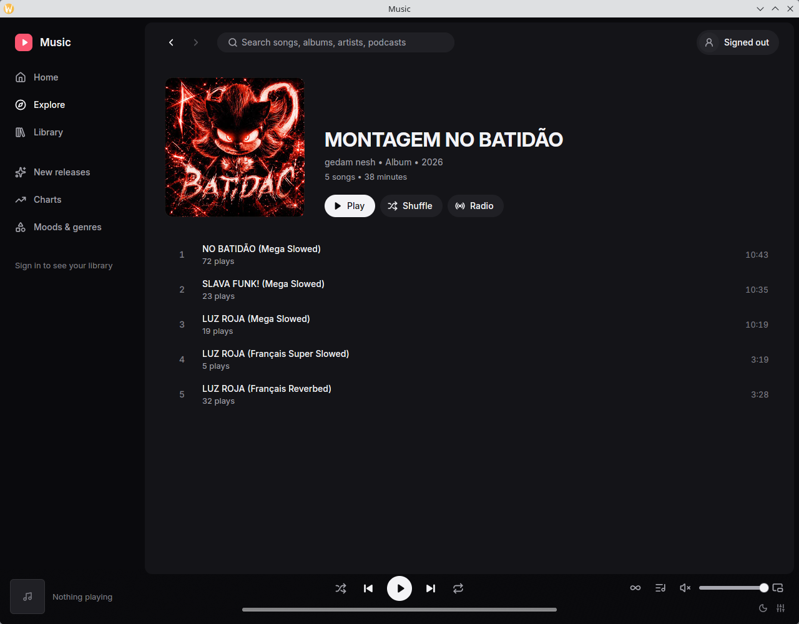
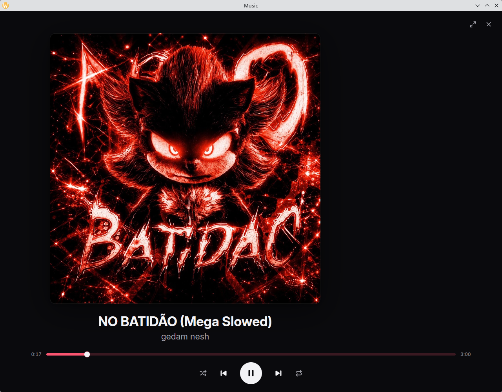

# ytfast-gpui

A native YouTube Music app for the desktop, written in Rust with [GPUI](https://www.gpui.rs), the UI framework behind the Zed editor. No Electron, no webview: GPUI draws the interface on the GPU, custom wgpu shaders draw the effects, and a built-in Rust audio engine plays the music. It runs on Linux (built for KDE Plasma on Wayland, X11 works too), Windows and macOS.



It's unofficial and not affiliated with YouTube or Google. It uses YouTube Music's private web API, so a change on YouTube's side can break it. It talks only to YouTube and Google, and to LRCLIB for timed lyrics (sending a song's title, artist, album and length, nothing else). No telemetry, no server of its own.

## Download

[Releases](https://github.com/jvz-devx/ytfast-gpui/releases) has installers for each system, built by `.github/workflows/release.yml`. They're test builds (pre-releases) and aren't signed. Nothing else needs installing and nothing else is bundled: the app finds the streams and plays them itself.

**macOS** (Apple silicon or Intel, macOS 11 or newer). With Homebrew:

```sh
brew tap jvz-devx/ytfast-gpui https://github.com/jvz-devx/ytfast-gpui
brew install --cask jvz-devx/ytfast-gpui/ytfast-gpui
```

Without Homebrew:

```sh
curl -fsSL https://raw.githubusercontent.com/jvz-devx/ytfast-gpui/main/scripts/install-macos.sh | bash
```

Both pick the build for your Mac and clear the quarantine flag, so the app opens without the Gatekeeper dialog even though it isn't notarized. The script checks the download against the release's `checksums.txt`, and Homebrew checks the SHA-256 in the cask. The script installs to /Applications, or to ~/Applications if you can't write to /Applications.

**Windows** (x86_64). In PowerShell:

```powershell
irm https://raw.githubusercontent.com/jvz-devx/ytfast-gpui/main/scripts/install-windows.ps1 | iex
```

The script downloads the setup program, checks it against `checksums.txt` and installs it for your user. A file downloaded this way doesn't get the browser's "downloaded from the internet" mark, so SmartScreen doesn't stop the unsigned setup. Once the package is accepted into winget, `winget install jvz-devx.ytfast` works too.

**Linux** (x86_64, glibc 2.35 or newer): the `.AppImage` (`chmod +x` it and run), or the `.deb` / `.rpm` (`sudo apt install ./ytfast-gpui-*.deb`, `sudo dnf install ./ytfast-gpui-*.rpm`). The packages add a "Music" menu entry and a `ytfast-gpui` command.

**By hand**, from [Releases](https://github.com/jvz-devx/ytfast-gpui/releases), checked against its `checksums.txt` if you like (`shasum -a 256` on macOS, `Get-FileHash` on Windows):

- macOS: open the `macos-arm64` or `macos-x86_64` `.dmg` and drag ytfast to Applications. The first time, macOS refuses to open it. On macOS 14 and earlier, right-click the app and choose Open; on macOS 15 and later, try to open it once, then choose Open Anyway in System Settings → Privacy & Security. `xattr -dr com.apple.quarantine /Applications/ytfast.app` does the same in a terminal.
- Windows: `…-setup.exe` installs for your user with a Start menu entry; SmartScreen warns about the unsigned installer: More info, Run anyway. `…-portable.zip` holds the same files.

Media keys and the system's media controls work everywhere (MPRIS on Linux, the media overlay on Windows, Now Playing on macOS). The tray, song-change notifications and following the system's light/dark setting are Linux-only for now, and on Windows and macOS closing the window quits.

**Updates:** once a day Music looks at Releases for a newer version and shows "Update available" in the top bar; Settings → Updates has Check now and the release notes. The AppImage, the Windows installer and the macOS app update themselves with Update and restart, however you installed them (Homebrew, winget, the scripts or by hand): the download must match the release's `checksums.txt`, and if the new version doesn't open its window within a minute, the previous one comes back. The `.deb`, `.rpm` and portable zip only say a new version is out, so update those the way you installed them. Pre-releases are offered while you run one (every release so far is one); Settings can turn that and the daily check off.

## What it does

- **Browse like YouTube Music:** Home with mood chips, Explore, Library (playlists, songs, albums, artists, history), album, artist, playlist and mood pages, search with suggestions and recent searches. The sidebar holds Liked music, your playlists and what you played recently.
- **Play:** a built-in Rust player with gapless playback at the best quality your account gets (Opus 256 kbps with Premium, about 160 kbps without), a queue you can edit and reorder, autoplay radios, timed lyrics that follow the song, Related, and loudness levelling between songs.
- **Effects:** Now Playing and Stage have a slowly flowing backdrop made from the cover with fine sparkles drifting round a soft light wave, a spectrum of the music and the song's waveform; the player bar glows in the cover's colours, its seek bar shows the waveform, and covers dissolve into each other on a new song. An audio visualiser (bars, mirrored bars, a ring round the cover, a line or a particle field) shows in Now Playing, in Stage or on its own full window (V). Settings → Visuals sets everything: presets (Off, Calm, Default, Vivid), each effect's switch and strengths, the particles' size, amount and twinkle, the visualiser's style, bars, sensitivity, frequencies and colours, and the frame rate (15 to 120 fps or the display's). Effects stop when hidden or paused and honour reduced motion.
- **Motion:** pages slide, scale or fade in the way you navigate, lyrics glide to the current line and fill as it's sung; Settings sets the speed, each kind of animation and reduced motion.
- **Extras:** a 10-band equalizer, a sleep timer, smooth mixes (crossfades on radios), audition (hold Alt over a song to hear its best part), the most-replayed part on the seek bar, Stage (cover and big lyrics, full screen) and a mini player.
- **Your account:** likes, saving albums and playlists, subscribing, and creating, editing and deleting playlists; plays count in your history.
- **On the desktop:** media keys and the system's media controls on Linux, Windows and macOS, a tray icon so music keeps playing with the window closed, song-change notifications, a command line, and light and dark that follow KDE.

| | |
| --- | --- |
|  |  |
|  |  |

These were taken signed out (with a local test track playing), so they show public YouTube Music.

## Keyboard and command line

Press **?** for every shortcut. The common ones: **Space** play or pause, **←/→** 5 seconds back or forward, **Shift+←/→** previous or next song, **+/-** volume, **M** mute, **L** like, **S** shuffle, **R** repeat, **N** Now Playing, **Q** Up next, **F** Stage, **E** equalizer, **P** the most replayed part, **/** search, **Alt+←/→** back and forward, **Ctrl+,** Settings, **Ctrl+Q** quit. Right-click a song, album, playlist or artist (or use its **⋮**) for Play next, Add to queue, Start radio, Like, Add to playlist and more. **Ctrl+K** opens Play anything: type to find and play, or a command like `radio <artist>`, `sleep 30` or `eq bass`.

The running app takes commands:

```sh
ytfast-gpui toggle        # play or pause (also: play, pause)
ytfast-gpui next          # or: previous
ytfast-gpui like          # like or unlike the playing song
ytfast-gpui show          # bring back the window
ytfast-gpui open <link>   # a YouTube Music or YouTube link; starts the app if needed
ytfast-gpui quit
```

## Signing in

Without a sign-in the app plays public YouTube Music. While signed out, **Sign in** (top right, in the sidebar and in Settings) offers three ways in:

- **Sign in with your browser:** it opens music.youtube.com in your default browser and connects as soon as a browser profile on this computer is signed in. It reads Firefox and LibreWolf on every system; Chromium-family browsers on Linux (Chrome, Chromium, Brave, with the key from the Secret Service or KWallet) and on macOS (Helium, Chrome, Brave, Edge, Arc, Chromium, with the key from the Keychain, which asks you once). It reads the cookie store without changing it. Chromium browsers on Windows aren't supported; use Firefox or a cookie file there.
- **Import a cookies file:** pick a Netscape-format `cookies.txt`; the app copies it into its config folder, readable only by you.
- **Paste cookies:** paste the `Cookie` header of a music.youtube.com request from your browser's developer tools.

YouTube rotates the cookies of a session that stays in use, so an exported file or pasted header works best from a private window you then close; [docs/integration.md](docs/integration.md) has the export details. Settings lists every sign-in source it found and, if your Google account has several YouTube channels, lets you pick the channel to act as. Cookie values are never logged or written anywhere others can read.

## Build from source

You need Rust 1.98 or newer, CMake, a C compiler and, on Linux, the Wayland/X11, xkbcommon, Vulkan, fontconfig and ALSA development packages. Nothing is needed at runtime beyond the audio system (PipeWire or PulseAudio, or ALSA, on Linux).

```sh
git clone https://github.com/jvz-devx/ytfast-gpui
cd ytfast-gpui/gpui
cargo run --release
```

## Development

The repository has two Cargo workspaces: the root crate (the backend library) and `gpui/` (the GPUI app, the `ytfast-visuals` effects crate and the `ytfast-audio` player). Common commands, via [just](https://github.com/casey/just):

```sh
just check gpui          # cargo check of one crate (gpui, visuals, audio, backend)
just test backend        # one crate's tests (the parser runs against saved YouTube responses)
just verify gpui         # fmt, check, tests and clippy for a crate, before you finish
just verify-workspace    # everything, at the end
just profiling           # a release-speed build without LTO, for measurements
just shaders             # validate the WGSL shaders with naga
cd gpui && bacon         # background checks while you edit
```

`scripts/gpui-smoke.sh` builds the release app, runs it signed out and drives it on the desktop (pages, playback across track changes, a seek, Now Playing, Up next), capturing each state. `scripts/gpui-input.sh` drives KDE Wayland for visual checks. `YTFAST_FAKE_STREAM=<audio file>` plays a local file instead of YouTube streams, for checks that don't need real streams.

Further reading: [docs/gpui/PLAN.md](docs/gpui/PLAN.md) (milestones and their evidence), [gpui/DESIGN.md](gpui/DESIGN.md) (the design system), [gpui/NOTES-visuals.md](gpui/NOTES-visuals.md) (effects and their costs), [docs/gpui/BUILD-SPEED.md](docs/gpui/BUILD-SPEED.md), [AGENTS.md](AGENTS.md) (rules for coding agents, and people).

## Credits

ytfast-gpui started from [ytfast](https://github.com/MayberryDT/ytfast) by Tyler Mayberry (MIT), whose backend it still builds on.

- [fastframe](https://github.com/crmne/fastframe) by Carmine Paolino (MIT): the log setup, and the self-updater is adapted from its `fastframe-update`.
- [GPUI](https://github.com/zed-industries/zed) by Zed Industries and [gpui-kit](https://github.com/longbridge/gpui-kit) (gpui-component) by Longbridge (both Apache-2.0).
- The player: [Symphonia](https://github.com/pdeljanov/Symphonia) (MPL-2.0) and [libopus](https://opus-codec.org) (BSD) decode, [cpal](https://github.com/RustAudio/cpal) (Apache-2.0) plays, [rubato](https://github.com/HEnquist/rubato) (MIT) resamples.
- The streams: the built-in resolver runs the challenge solver scripts of [yt-dlp-ejs](https://github.com/yt-dlp/ejs) (Unlicense) in QuickJS through [rquickjs](https://github.com/DelSkayn/rquickjs) (MIT); it follows what [yt-dlp](https://github.com/yt-dlp/yt-dlp) learned about YouTube's clients.
- Lyrics from [LRCLIB](https://lrclib.net); media controls on Windows and macOS through [souvlaki](https://github.com/Sinono3/souvlaki) (MIT).
- The [Inter](https://rsms.me/inter/) typeface (OFL) and [Lucide](https://lucide.dev) icons (ISC).

The notices the installers carry (Symphonia, libopus, QuickJS, the solver scripts) are in `gpui/packaging/THIRD-PARTY.txt`.

## License

[MIT](LICENSE).
